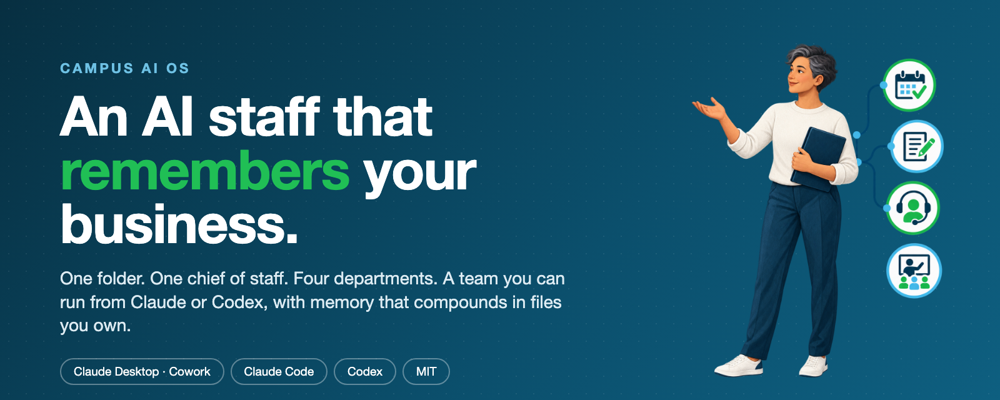
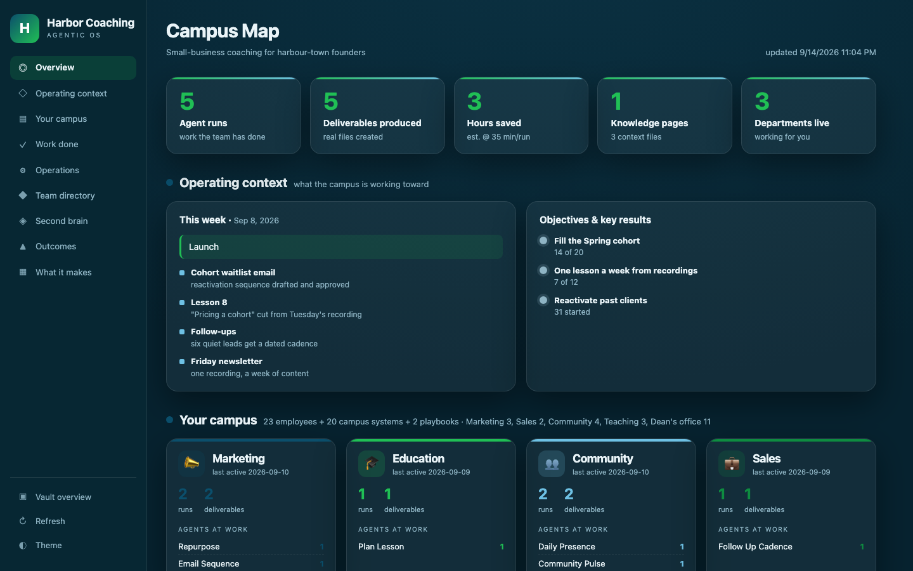
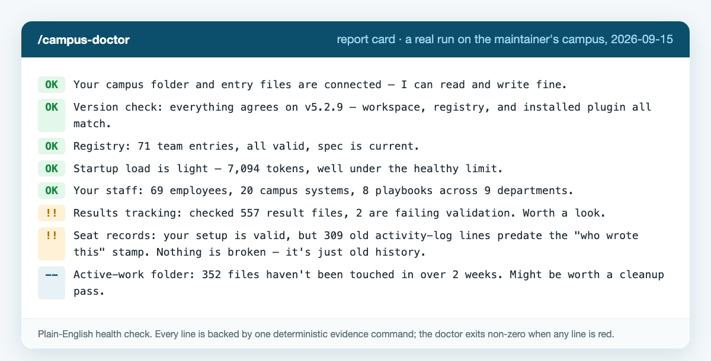
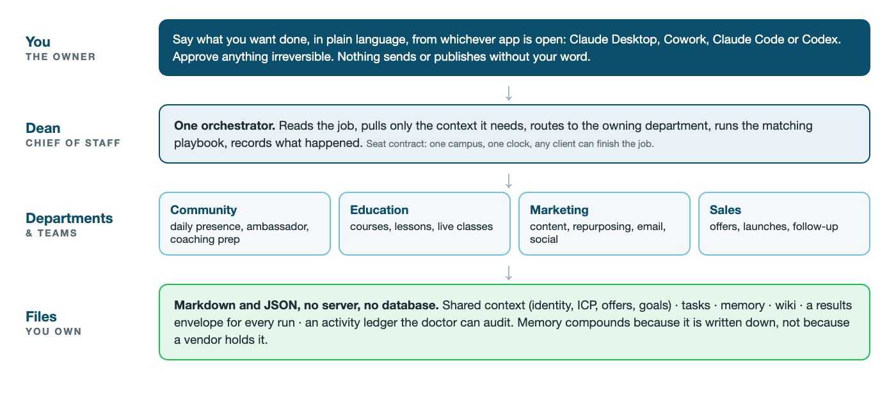

<p align="center">
  
</p>

<p align="center">
  <a href="https://github.com/trainingsites/campus-ai-os/releases/latest"></a>
  <a href="https://github.com/trainingsites/campus-ai-os/actions/workflows/ci.yml"></a>
  <a href="LICENSE"></a>
  
  
  
</p>

<p align="center">
  <a href="#get-it-running">Install</a> · <a href="#see-it-work">See it work</a> · <a href="#how-it-is-built">How it is built</a> · <a href="#what-is-included">What is included</a> · <a href="CHANGELOG.md">Changelog</a> · <a href="SECURITY.md">Security</a> · <a href="https://trainingsites.io/os">Non-developer install</a>
</p>

# Campus AI OS

**An AI staff that remembers your business. One folder. One chief of staff. A team you can use from Claude or Codex.**

Campus AI OS turns a folder into the operating system for your business. It gives you Dean, your AI chief of staff; shared memory that compounds; four departments; a starter team of AI employees; and playbooks that carry multi-step work from request to finished result.

It is free, open source, and MIT-licensed. Your business remains in files you own: mostly Markdown and JSON, with no server or database required.

> Not a developer? [Download Campus AI OS free at TrainingSites.io](https://trainingsites.io/os). It is the same release, with the simplest installation path.

## See it work

<p align="center">
  <a href="https://www.youtube.com/watch?v=-c77SUQNxwo"></a>
  <br/>
  <sub>▶️ <a href="https://www.youtube.com/watch?v=-c77SUQNxwo"><strong>How Campus OS helps run my business</strong></a> · a real week, not a demo reel</sub>
</p>

| The Campus Map | The doctor's report card |
|---|---|
|  |  |
| Every campus can render a private map of itself: what the team did, what it shipped, what this week is for. This one is a fictional campus built from the kernel's own fixtures. | `/campus-doctor` is a plain-English health check. Every line is backed by one evidence command, and it exits non-zero when anything is red. This is a real run on the maintainer's campus. |

More walkthroughs: [My full agent setup on Campus OS](https://www.youtube.com/watch?v=6r-byjX-bCs) · [Live install, warts and all](https://www.youtube.com/watch?v=E5DpN7F4U1I)

## How it is built

<p align="center">
  
</p>

- **You** say what you want done from whichever app is open. Nothing sends or publishes without your word.
- **Dean** is the single orchestrator. It pulls only the context a job needs, routes to the owning department, runs the matching playbook, and records what happened.
- **Departments and teams** are Community, Education, Marketing and Sales, each with a starter roster of AI employees and playbooks.
- **Files you own** hold everything: identity, ICP, offers, goals, tasks, memory, wiki, a results envelope for every run, and an activity ledger the doctor can audit.

One campus, one clock. Several clients can be primary on the same installation and finish work where they are; only the clock owner runs schedules and writes the shared ledger. See [PLATFORM.md](PLATFORM.md).

## Get it running

### Claude Desktop or Cowork

Download `campus-ai-os-v5.2.9.plugin` from the [latest release](https://github.com/trainingsites/campus-ai-os/releases/latest), then install it from **Settings → Plugins → Install from file**.

### Claude Code

```text
/plugin marketplace add trainingsites/campus-ai-os
/plugin install campus-ai-os@campus-ai-os
```

### Codex

Open **Settings → Plugins → Add marketplace**, choose a Git source, and enter:

```text
https://github.com/trainingsites/campus-ai-os
```

Install **Campus AI OS**, then begin in a new task so the skills are loaded.

### Start your campus

Connect an empty folder and say:

```text
/campus-start
```

Choose the ten-minute quick start or the full onboarding. Campus AI OS creates the working context your AI staff needs—your audience, offers, voice, goals, departments, tools, and operating rules—then helps you produce your first real deliverable.

See [QUICKSTART.md](QUICKSTART.md) for the guided walkthrough and [CODEX-INSTALL.md](CODEX-INSTALL.md) for additional Codex instructions.

---

## What problem it solves

### Your AI forgets your business

Most AI conversations begin at zero. You explain your audience, offers, voice, and priorities again and again.

Campus AI OS records that context once in readable files. Every skill works from the same source of truth, and the built-in wiki turns completed work into memory you can query later.

### A collection of prompts is not a team

Campus AI OS gives the work an operating structure:

```text
You
 └── Dean — your chief of staff and the one AI you talk to
      ├── Departments — Sales, Marketing, Education, Community, and more
      │    └── Playbooks — complete workflows with gates and results
      │         └── Skills — one worker for one defined job
      └── Shared memory — your business context, decisions, wiki, and history
```

Departments provide ownership. Playbooks provide sequence and verification. Skills do the work. Dean coordinates the system so you do not have to remember which employee or tool comes next.

### “It worked” should be provable

`/campus-doctor` checks the campus and reports problems in plain language. Playbooks write a structured result record, including what ran, what it produced, and whether it completed. The repository runs the same fixture suite before a release is accepted.

---

## What is new in v5.2.9

Version 5.2.9 makes one Campus safe to use from multiple AI applications on the same computer.

- **Work from whichever client is open.** Claude Desktop, Claude Code, and Codex can each be recognized as primary clients on the same owner installation. Any recognized client can finish its own work, close tasks, and update shared context.
- **One campus, one clock.** Exactly one configured client owns recurring jobs and the shared activity ledger. Other primary clients write to their own ledger shards, preventing duplicate schedules.
- **Unknown clients remain contained.** An unrecognized computer, unassigned client, expired host binding, or unbound sandbox still resolves as a satellite with restricted write access.
- **The doctor understands co-primary campuses.** Legitimate work from another recognized client is no longer reported as unresolved attribution, while unknown writers are still flagged.
- **226 automated fixtures.** Seventeen new co-primary tests cover role resolution, clock ownership, ledger routing, host binding, backward compatibility, and the unchanged satellite boundary.

Existing single-primary campuses continue to work as before. Co-primary support changes collaboration on one recognized installation; it does not broaden who is trusted.

### Security work carried forward from v5.2.6–v5.2.8

- Blocked path traversal and symlink escape from the Campus Map generator.
- Blocked stored script injection through Markdown link targets and unsafe brand fields.
- Added Content Security Policy protection to generated Campus Maps.
- Removed the public or sales-demo Campus Map build. Campus Maps are private workspace artifacts only.
- Added an offline mode for private Campus Maps that makes no font request.

See [CHANGELOG.md](CHANGELOG.md) for the complete release history and [SECURITY.md](SECURITY.md) for the operating boundary.

---

## What is included

| Component | Included | Purpose |
|---|---:|---|
| Skills | 43 | Onboarding, memory, planning, content, teaching, marketing, sales, community, and workforce governance |
| Commands | 36 | Simple entry points such as `/morning-brief`, `/weekly-review`, and `/campus-doctor` |
| Playbooks | 2 | Weekly Reset and One Recording to a Week of Content, plus the runtime that executes them |
| Niche packs | 1 | The education pack for educators, coaches, course creators, and consultants |
| Tools | 20 | Packaging, validation, health evidence, seat resolution, contracts, and workspace checks |
| Tests | 226 | Automated fixtures that protect installation, upgrades, security boundaries, and multi-client operation |

### Useful commands

| Command | Outcome |
|---|---|
| `/campus-start` | Create and configure a new campus |
| `/campus-first-win` | Produce the first useful deliverable with your team |
| `/morning-brief` | See today’s priorities and what changed |
| `/weekly-review` | Review progress and plan the coming week |
| `/repurpose` | Turn one recording into a week of content |
| `/build-course` | Build a course structure and lesson plan |
| `/offer-builder` | Shape an offer around the outcome it delivers |
| `/email-sequence` | Draft a complete email sequence |
| `/wiki-ingest` | Turn durable work into reusable knowledge |
| `/wiki-query` | Ask questions of your accumulated business knowledge |
| `/campus-map` | Generate a private dashboard of your campus |
| `/campus-doctor` | Check whether the system is healthy |

---

## Your files and your authority

Campus AI OS follows three rules:

1. Files in `inputs/` are source material and are never modified.
2. Nothing irreversible—publishing, sending, deleting, charging, or changing a live system—happens without your approval.
3. A substantial build begins with a short plan you can inspect before work starts.

The kernel does not need a hosted service. It runs from the files in your connected campus and can move with that folder.

---

## Free software, paid help when you want it

Everything in this repository is free and MIT-licensed. Use it, change it, fork it, or build on it.

TrainingSites sells help operating the system: configuring it around a real business, staffing it for the required outcomes, and working through the first implementation with the owner. The software remains free whether or not you purchase that help.

- [Download and learn about Campus AI OS](https://trainingsites.io/os)
- [Join the TrainingSites community](https://trainingsites.io/register)
- [Explore additional agent teams](https://trainingsites.io/team)

---

## Documentation

- [Quick start](QUICKSTART.md)
- [Platform behavior](PLATFORM.md)
- [Codex installation](CODEX-INSTALL.md)
- [Playbooks](playbooks/README.md)
- [Changelog](CHANGELOG.md)
- [Security](SECURITY.md)
- [Contributing](CONTRIBUTING.md)

## Contributing

Issues and focused pull requests are welcome. Keep changes portable, do not hardcode host-specific paths, and run the fixture suite before opening a pull request:

```bash
bash tests/run-tests.sh
```

## License

Campus AI OS is released under the [MIT License](LICENSE).
